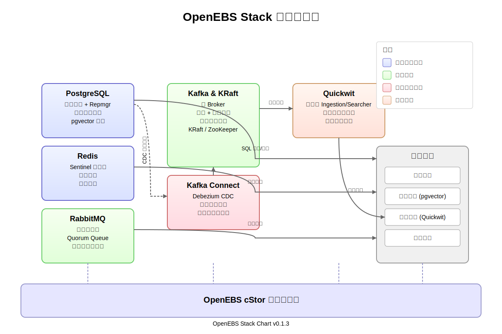

# OpenEBS Stack 部署文档

## 目录

- [概述](#概述)
- [系统架构](#系统架构)
- [前置要求](#前置要求)
- [初始化存储系统](#初始化存储系统)
- [单机版部署](#单机版部署)
- [高可用版部署](#高可用版部署)
- [验证部署](#验证部署)
- [故障排除](#故障排除)
- [管理与运维](#管理与运维)
- [卸载与清理](#卸载与清理)

## 概述

OpenEBS Stack 是一个完整的大数据服务部署方案，包含以下核心组件：

- **PostgreSQL**：高性能关系型数据库，支持 pgvector 向量扩展
- **Redis**：高性能键值缓存数据库
- **RabbitMQ**：高可靠消息队列
- **Kafka**：分布式流处理平台
- **Quickwit**：高性能全文索引引擎
- **Debezium CDC + Kafka Connect**：数据变更捕获和同步工具
- **OpenEBS + cStor**：云原生存储解决方案

该项目提供单机开发环境和生产级高可用环境两种部署方案，满足不同场景需求。

## 系统架构



系统由以下几个层次组成：

1. **数据存储层**：包括 PostgreSQL 和 Redis，提供持久化和缓存存储能力
2. **消息处理层**：包括 Kafka 和 RabbitMQ，提供高吞吐的消息传输能力
3. **数据处理层**：包括 Kafka Connect 和 Debezium，实现数据变更捕获和同步
4. **搜索服务层**：包括 Quickwit，提供高效全文检索能力
5. **存储层**：OpenEBS cStor 提供底层持久化存储能力

## 前置要求

### 系统要求

- **单机版**：
  - Kubernetes 集群（1.19+）
  - 至少 4GB RAM，4 CPU 核心
  - 至少 50GB 可用磁盘空间
  
- **高可用版**：
  - Kubernetes 集群（1.19+）
  - 至少 3 个工作节点
  - 每个节点至少 8GB RAM，8 CPU 核心
  - 每个节点至少 100GB 可用磁盘空间
  - 节点间网络延迟小于 10ms

### 软件要求

- kubectl 1.19+
- Helm 3.5+
- OpenEBS 3.0+

## 初始化存储系统

在部署 OpenEBS Stack 前，必须先初始化 OpenEBS 和 cStor 存储系统。

### 1. 添加 OpenEBS 源并安装初始化脚本

使用项目中提供的初始化脚本进行安装：
- 至少 1 个空闲块设备，用于 OpenEBS cStor 存储池
- 空间不小于 100GB

```bash
chmod +x init-openebs-cstor.sh
./init-openebs-cstor.sh
```

此脚本将自动完成以下操作：

1. 安装 OpenEBS 核心组件
2. 安装 CStor CSI 驱动
3. 获取和配置可用块设备
4. 创建 CStorPoolCluster
5. 创建 StorageClass

### 2. 验证 OpenEBS 安装

执行以下命令检查 OpenEBS 组件状态：

```bash
kubectl get pods -n openebs
kubectl get sc openebs-cstor
```

确保所有 Pod 处于 Running 状态，且 openebs-cstor StorageClass 创建成功。

## 单机版部署

单机版适合开发和测试环境，所有组件单副本部署。

### 1. 添加 Bitnami 仓库

```bash
helm repo add bitnami https://charts.bitnami.com/bitnami
helm repo update
```

### 2. 更新 Helm 依赖

在项目根目录执行：

```bash
helm dependency update .
```

### 3. 自定义配置（可选）

默认配置文件为 `values.yaml`。如需修改，可以创建自定义配置文件，例如：

```bash
cp values.yaml custom-values.yaml
# 编辑 custom-values.yaml 文件
```

常见自定义项：

- 修改数据库密码
- 调整存储容量
- 配置资源限制

### 4. 部署单机版

```bash
helm install openebs-stack . -f values.yaml
```

如使用自定义配置：

```bash
helm install openebs-stack . -f custom-values.yaml
```

### 5. 检查部署状态

```bash
kubectl get pods -l app.kubernetes.io/instance=openebs-stack
```

等待所有 Pod 变为 Running 状态。

## 高可用版部署

高可用版适合生产环境，所有核心组件多副本部署，实现高可用性。

### 1. 前置准备

同单机版一样，确保已添加 Bitnami 仓库并更新依赖：

```bash
helm repo add bitnami https://charts.bitnami.com/bitnami
helm repo update
helm dependency update .
```

### 2. 自定义高可用配置（可选）

默认高可用配置文件为 `values-prod-all.yaml`。如需修改，可以创建自定义配置：

```bash
cp values-prod-all.yaml custom-ha-values.yaml
# 编辑 custom-ha-values.yaml
```

高可用配置的主要特点：

- **PostgreSQL**：启用 PostgreSQL-HA Chart，配置主从复制和 Repmgr
- **Redis**：配置 Sentinel 模式，实现自动故障转移
- **RabbitMQ**：配置集群模式和 Quorum 队列
- **Kafka**：使用 KRaft 模式，多副本部署
- **Quickwit**：多副本部署

### 3. 部署高可用版

- 高可用部署 Quickwit 依赖 Minio 作为索引存储，需提前创建存储桶

```bash
helm install openebs-stack . -f values-prod-all.yaml
```

如使用自定义高可用配置：

```bash
helm install openebs-stack . -f custom-ha-values.yaml
```

### 4. 检查高可用部署状态

```bash
kubectl get pods -l app.kubernetes.io/instance=openebs-stack
```

验证各组件副本数：

```bash
# 检查 PostgreSQL HA 状态
kubectl get pods -l app.kubernetes.io/name=postgresql-ha

# 检查 Redis Sentinel 状态
kubectl get pods -l app.kubernetes.io/name=redis

# 检查 RabbitMQ 集群状态
kubectl get pods -l app.kubernetes.io/name=rabbitmq

# 检查 Kafka 状态
kubectl get pods -l app.kubernetes.io/name=kafka

# 检查 Kafka Connect 状态
kubectl get pods -l app=kafka-connect

# 检查 Quickwit 状态
kubectl get pods -l app=quickwit
```

## 验证部署

### 1. 检查服务连接性

#### PostgreSQL

```bash
# 单机版
kubectl run -i --rm --tty psql-client --image=postgres:16 --restart=Never -- \
  psql -h openebs-stack-postgresql -U postgres -d yourdb -c "SELECT version();"

# 高可用版
kubectl run -i --rm psql-client  --image=postgres:16 --restart=Never --env="PGPASSWORD=$(kubectl get secret openebs-stack-postgresql-ha-postgresql -o jsonpath="{.data.password}" | base64 -d)" --command -- psql -h openebs-stack-postgresql-ha-pgpool -U postgres -d yourdb -c "SELECT version();"
```

#### Redis

```bash
kubectl exec -it openebs-stack-redis-node-0 -- redis-cli -h openebs-stack-redis -a "redis-password" ping
```

#### RabbitMQ

```bash
kubectl exec -it openebs-stack-rabbitmq-0 -- rabbitmqctl cluster_status
```

### 2. 验证数据同步链路

执行脚本：
```
./scripts/setup-data-flow.sh
```

## 故障排除

### 常见问题解决方案

1. **Pod 启动失败**

   检查 Pod 日志：
   ```bash
   kubectl logs <pod-name>
   ```

   检查 Pod 描述：
   ```bash
   kubectl describe pod <pod-name>
   ```

2. **存储问题**

   检查 PVC 状态：
   ```bash
   kubectl get pvc
   ```

   检查 PV 状态：
   ```bash
   kubectl get pv
   ```

   检查 OpenEBS 存储池：
   ```bash
   kubectl get cspc -n openebs
   kubectl get cspi -n openebs
   ```

3. **组件连接问题**

   可使用临时调试 Pod：
   ```bash
   kubectl run -i --rm --tty debug-pod --image=busybox --restart=Never -- sh
   ```

### 日志收集

收集关键组件日志：

```bash
# 创建日志目录
mkdir -p openebs-stack-logs

# 收集 PostgreSQL 日志
kubectl logs $(kubectl get pod -l app.kubernetes.io/name=postgresql -o name | head -1) > openebs-stack-logs/postgresql.log

# 收集 Kafka 日志
kubectl logs $(kubectl get pod -l app.kubernetes.io/name=kafka -o name | head -1) > openebs-stack-logs/kafka.log

# 收集 Kafka Connect 日志
kubectl logs $(kubectl get pod -l app=kafka-connect -o name | head -1) > openebs-stack-logs/kafka-connect.log

# 收集 Quickwit 日志
kubectl logs $(kubectl get pod -l app=quickwit -o name | head -1) > openebs-stack-logs/quickwit.log
```

## 管理与运维

### 扩展集群

#### 扩展 Kafka 集群（高可用版）

```bash
helm upgrade openebs-stack . -f values-prod-all.yaml --set kafka.controller.replicaCount=5
```

#### 扩展 PostgreSQL 副本（高可用版）

```bash
helm upgrade openebs-stack . -f values-prod-all.yaml --set postgresql-ha.replicaCount=5
```

### 升级组件版本

例如升级 PostgreSQL 版本：

```bash
# 编辑 values-prod-all.yaml，修改 PostgreSQL 镜像版本
helm upgrade openebs-stack . -f values-prod-all.yaml
```

### 备份与恢复

1. **PostgreSQL 备份**：

```bash
# 创建备份文件夹
kubectl exec -it openebs-stack-postgresql-0 -- pg_dump -U postgres -d yourdb > postgres_backup.sql
```

2. **PostgreSQL 恢复**：

```bash
cat postgres_backup.sql | kubectl exec -i openebs-stack-postgresql-0 -- psql -U postgres -d yourdb
```

## 卸载与清理

### 1. 卸载 Helm 应用

```bash
helm uninstall openebs-stack
```

### 2. 清理 PVC（可选，谨慎操作）

```bash
kubectl delete pvc --all
```

### 3. 移除 OpenEBS（可选，谨慎操作）

```bash
# 移除 cStor 存储池
kubectl delete cspc --all -n openebs

# 卸载 OpenEBS 操作符
kubectl delete -f https://openebs.github.io/charts/cstor-operator.yaml
kubectl delete -f https://openebs.github.io/charts/openebs-operator.yaml
```

## 附录

### 各组件默认配置

#### 单机版

| 组件 | 配置 | 说明 |
|-----|------|-----|
| PostgreSQL | 单实例 | 支持 pgvector |
| Redis | 单实例 | 无高可用 |
| RabbitMQ | 单实例 | 持久化存储 |
| Kafka | KRaft 单节点 | 认证启用 |
| Kafka Connect | 单实例 | Debezium CDC |
| Quickwit | 单实例 | 使用本地存储 |

#### 高可用版

| 组件 | 配置 | 说明 |
|-----|------|-----|
| PostgreSQL | 3节点集群 (1主2从) + 2 pgpool | Repmgr 自动故障转移 + pgvector |
| Redis | Sentinel 模式 | 3节点(哨兵 + Redis 组合模式) |
| RabbitMQ | 3节点集群 | 支持 Quorum Queue |
| Kafka | 3节点 KRaft | 无需 ZooKeeper |
| Kafka Connect | 3节点 | Debezium CDC |
| Quickwit | 3节点集群 | 共享 MinIO 存储 |

### 资源消耗参考

#### 单机版总资源需求

| 资源 | 最小需求 |
|-----|---------|
| CPU | 4 核 |
| 内存 | 8 GB |
| 存储 | 50 GB |

#### 高可用版总资源需求（每节点）

| 资源 | 最小需求 |
|-----|---------|
| CPU | 8 核 |
| 内存 | 16 GB |
| 存储 | 100 GB |